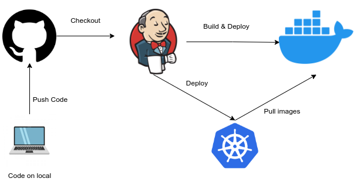

# go-jenkins

The code is push to github and then jenkins will triggered by the github. After that jenkins will build the image from the code using dockerfile. Next step jenkins will push the docker image to docker registry. *After that jenkins will deploy the the docker image to kubernetes by exect `deploymentservice.yml`.

*= I don't deploy to kubernetes exactly, I just create the manifest only 

image link: https://hub.docker.com/repository/docker/oryzasativa29/godocker